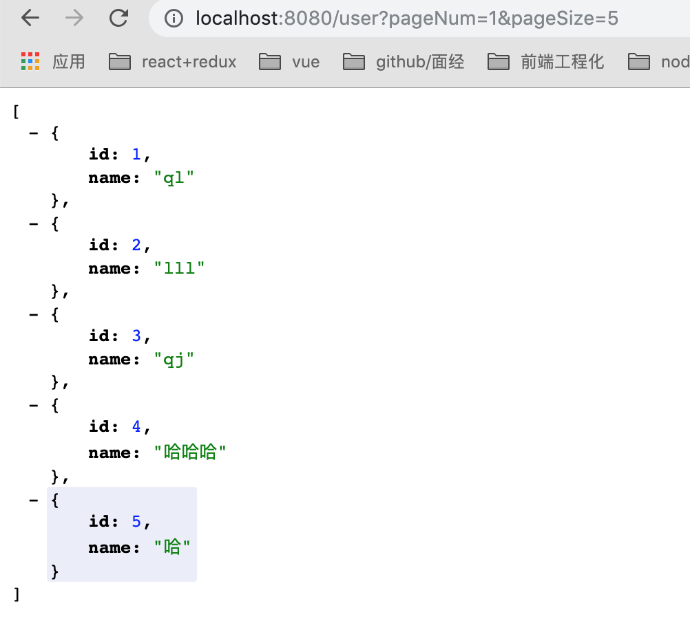

## MyBatis 进阶练习
### 练习描述
- 根据图建表数据库名叫`user`表名也是`user`，user表里包含两个字段如题所示：
自增的`id`和字符串`name`
- 更改`build.gradle`依赖配置，增加`pageHelper`插件
- 在Mybatis基础练习的基础上编写`UserMapper`和`UserController`文件，使查user这个接口具有
分页功能。

### 环境描述
- java8
- Intellij-IDEA

### 如何开始
克隆模版库
- 在build.gradle中添加依赖pageHelper配置
- 更改UserController和UserMapper`查`接口
- 仅截图分页接口，新建文件夹`result`并放在里边
- 小步提交上传代码
